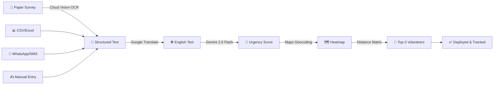
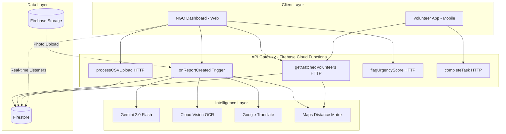

# AlloCare — Smart Volunteer Deployment for Social Impact

🌐 **[Live Demo →](https://allocare-77.web.app)** | 📹 **[Demo Video →](https://youtu.be/XXXX)** | 📊 **[Pitch Deck →](./docs/pitch_deck.pdf)**

> **From paper survey to matched volunteer in 60 seconds.** Powered by Gemini AI.


---

## 🎯 Problem Statement

**Smart Resource Allocation** — Google Solution Challenge 2026

Local NGOs and community groups collect valuable need-data through paper surveys, WhatsApp messages, and field reports. This data sits siloed in physical files, disconnected spreadsheets, or a single coordinator's memory. **No system currently aggregates it to surface urgency patterns** — and no intelligent bridge exists to route available volunteers to where they are needed most, in real time.

## 💡 Solution: AlloCare

AlloCare (Allocation + Care) is a three-layer intelligent pipeline:



1. **Multi-source data ingestion** — converts paper, CSV, WhatsApp, and text into structured need records
2. **Gemini-powered urgency intelligence** — scores, clusters, and visualizes needs geographically
3. **Algorithm-driven volunteer matching** — deploys the right person to the highest-priority task in real time

## 🖼️ Screenshots

<!-- Add 5+ screenshots here -->
| Dashboard with Heatmap | Need Detail + Urgency Formula | Volunteer Matching |
|:---:|:---:|:---:|
| Coming soon | Coming soon | Coming soon |

| Upload Report (OCR) | Processing Pipeline | Impact Scorecard |
|:---:|:---:|:---:|
| Coming soon | Coming soon | Coming soon |

## 🛠️ Tech Stack — Google Technologies

| Layer | Technology | Purpose |
|-------|-----------|---------|
| **AI Brain** | Gemini 2.0 Flash | Urgency extraction, coordinator explanations, impact framing |
| **OCR** | Cloud Vision API | Paper survey → digital text (printed + handwritten) |
| **Database** | Cloud Firestore | Real-time NoSQL with live heatmap listeners |
| **Auth** | Firebase Auth | Google Sign-In for coordinators and volunteers |
| **Hosting** | Firebase Hosting | Live demo deployment |
| **Functions** | Cloud Functions (Python) | Serverless processing pipeline |
| **Maps** | Maps JavaScript API | Urgency heatmap + distance-based matching |
| **Distance** | Distance Matrix API | Real-world driving distances for volunteer proximity |
| **Geocoding** | Geocoding API | Location text → lat/lng coordinates |
| **Translation** | Cloud Translation API | Hindi, Marathi, Tamil, Bengali → English |
| **Notifications** | Firebase Cloud Messaging | Push alerts for critical needs |
| **Frontend** | Web (HTML/CSS/JS) | NGO coordinator dashboard |

## 🏗️ Architecture



## 🚀 Quick Start

```bash
# Clone the repo
git clone https://github.com/d4a1k11s19h8/allocare.git
cd allocare

# Install and run Frontend
cd frontend
npm install
npm run dev
```

For local development of the dashboard:
```bash
# Start local server for dashboard
cd ..
npx serve public -l 3000

# Or use Firebase emulators
firebase emulators:start
```

## 📐 Urgency Scoring Algorithm (Transparent AI)

```
urgency_score = (severity × log(frequency + 1)) / max(1, days_since_first_report)
normalized    = min(100, round(urgency_score × 10))

0–30   → LOW      (green)   — Routine attention
31–60  → MEDIUM   (amber)   — Plan this week
61–85  → HIGH     (orange)  — Address within 48 hours
86–100 → CRITICAL (red)     — Immediate action + volunteer push notification
```

**Explainability:** The formula is displayed on every need card. Coordinators can override any AI-scored urgency with the "Flag" button — corrections are logged to improve the model over time. This implements the **participatory AI** framework (Nesta, 2021).

## 🤖 Volunteer Matching Algorithm

```
match_score = skill_overlap_score × proximity_score × availability_score

skill_overlap  = matched_skills / required_skills    ∈ [0, 1]
proximity      = 1 / (1 + distance_km)               — decays with distance
availability   = 1.0 if available now, else 0.3
```

Returns **top-3 volunteers** with plain-English explanations:
> "Matched because: Medical First Aid ✓ · 2.3km away ✓ · Available now ✓"

## 🌍 SDG Alignment

- **SDG 1 — No Poverty:** Routes food security and basic needs resources to highest-urgency areas
- **SDG 10 — Reduced Inequalities:** Prioritizes underserved communities invisible to traditional volunteer platforms
- **SDG 17 — Partnerships for the Goals:** Creates technology bridge between data-rich NGOs and skill-rich volunteers
- **SDG 11 — Sustainable Cities:** Supports urban NGOs managing complex multi-zone community needs

## 📚 Research Citations

| Paper | Key Finding | Used In |
|-------|------------|---------|
| AI Adoption in NGOs (arXiv, 2025) | AI reduces data entry by 60%, allocation time by 30% | Core justification |
| AI-Powered Philanthropy (SSRN, 2025) | 40% higher volunteer retention with impact framing | Task card design |
| Participatory AI (Nesta, 2021) | Human-in-loop is gold standard for NGO AI tools | Flag/override system |
| NLP for Humanitarian Action (Frontiers, 2023) | Build ingestion from existing tools, not new collection | KoBoToolbox integration |

## ♿ Accessibility & Ethics

- **WCAG 2.1 AA** compliance — 4.5:1 contrast minimum, color + icon for urgency (never color alone)
- **Transparent AI** — urgency formula displayed on screen, human override enabled
- **Privacy** — volunteer locations rounded to ±1km, no individual PII in field reports
- **Free forever** for small NGOs — technology should not be a barrier to social impact


## 📄 License

MIT License — Free for NGOs, always.

---

*AlloCare — Google Solution Challenge 2026 · Hack2Skill × GDG on Campus × Google*
